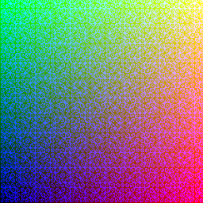
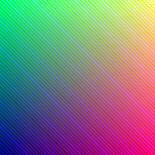
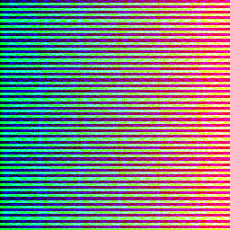
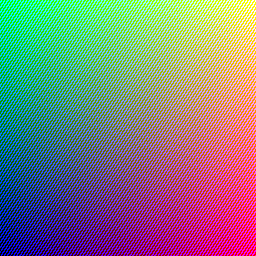
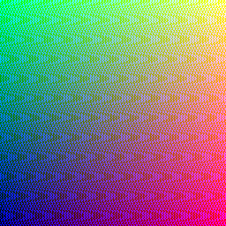
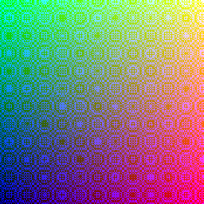
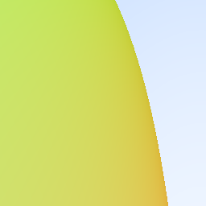

# Ray Tracer

# Samples

In all the samples, $H$ is the height and $W$ is the width(both set as $256$). The vector notation is used to represent the RGB triplets.

$i$ and $j$ are variables that range from $0 \to W$ and $H \to 0$ respectively. 

## Patterns

### Sinusoidals

The sinusoidals in the first sample are generated by the following formula : 

$$
    \begin{pmatrix}
    \frac{i}{W - 1} \\
    \frac{j}{H - 1} \\ 
    W\sin(ij)
    \end{pmatrix}
$$

### Linear Gradient

